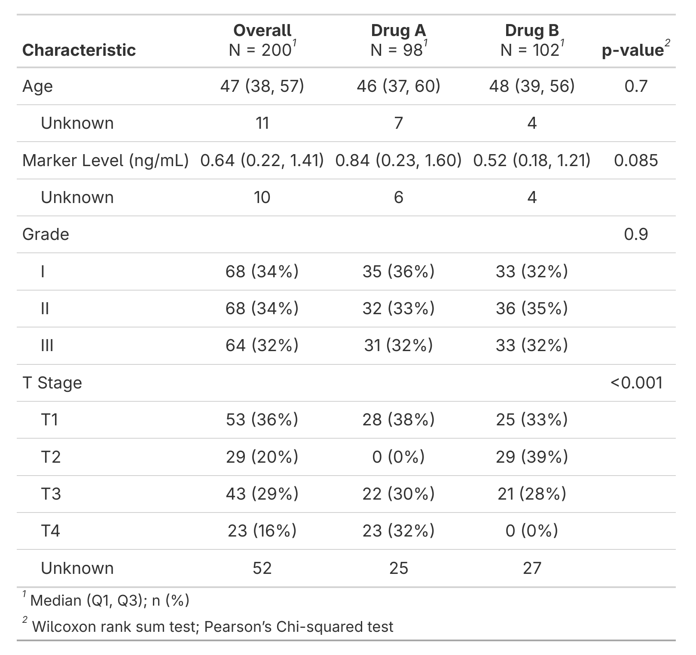
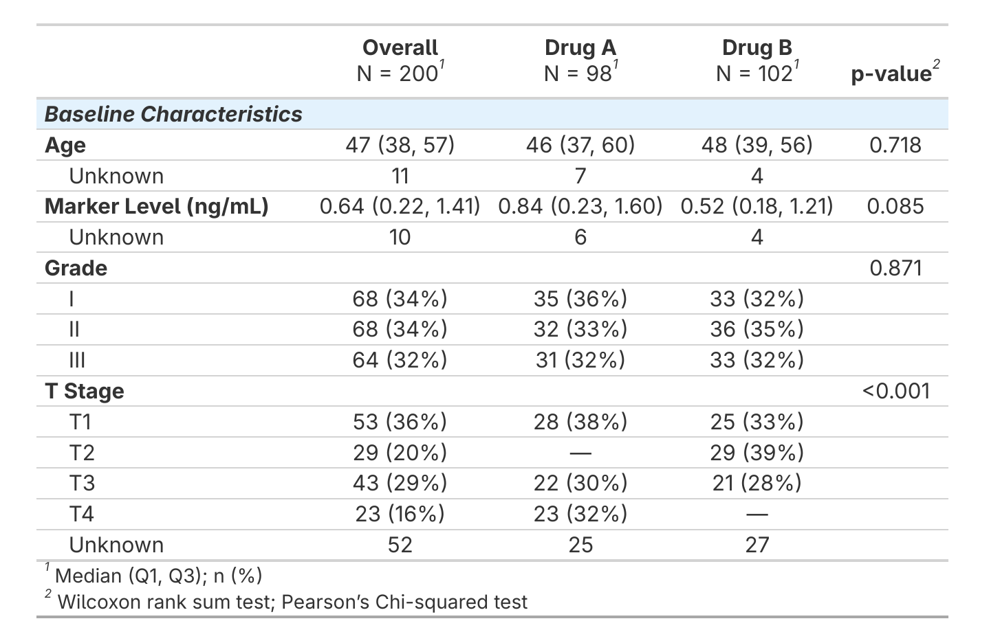

# sumExtras 

<!-- badges: start -->

[](https://github.com/kyleGrealis/sumExtras/actions/workflows/R-CMD-check.yaml)
[](https://CRAN.R-project.org/package=sumExtras)
[](https://lifecycle.r-lib.org/articles/stages.html#stable)
[](https://github.com/kyleGrealis/sumExtras/tree/main/tests/testthat)

<!-- badges: end -->

> *Some extras for gtsummary tables*

## Overview

**sumExtras** provides convenience functions for gtsummary and gt tables, including automatic variable labeling from dictionaries, standardized missing value display, and consistent formatting helpers for streamlined table styling workflows.

## Installation

### CRAN

``` r
install.packages("sumExtras")
```

### Development version

You can install the development version of sumExtras from GitHub:

``` r
# install.packages("pak")
pak::pak("kyleGrealis/sumExtras")
```

Alternatively, using remotes:

``` r
# install.packages("remotes")
remotes::install_github("kyleGrealis/sumExtras")
```

## See the Difference

```r
my_table <- trial |>
  mutate(
    stage = case_when(
      trt == 'Drug A' & stage == 'T2' ~ NA,
      trt == 'Drug B' & stage == 'T4' ~ NA,
      .default = stage
    )
  ) |>
  select(age, marker, grade, stage, trt) 
```

<table>
<tr>
<td width="50%" valign="top">

**Basic gtsummary**



</td>
<td width="50%" valign="top">

**sumExtras with Advanced Styling**



</td>
</tr>
<tr>
<td width="50%" valign="top">

```r
my_table |> 
  tbl_summary(by = trt) |>
  add_overall() |>
  add_p()
```

</td>
<td width="50%" valign="top">

```r
# Apply JAMA theme
use_jama_theme()

my_table |>
  tbl_summary(by = trt) |>
  extras() |>
  add_variable_group_header(
    header = "Baseline Characteristics",
    variables = age:stage
  ) |>
  add_group_styling() |>
  add_group_colors(color = "#E3F2FD")
```

</td>
</tr>
</table>

The basic approach creates a functional table, but sumExtras makes it shine with group headers, custom formatting, background colors, and clean missing value display—all while maintaining readable code. The right example shows what's possible when you need publication-ready tables.

## Quick Start

```r
library(sumExtras)
library(gtsummary)

# Apply the recommended JAMA theme (optional but recommended)
use_jama_theme()

# The extras() function - does it all!
trial |>
  tbl_summary(by = trt) |>
  extras()  # Adds overall, p-values, cleans missing values, and more!

# Clean missing values independently
trial |>
  tbl_summary(by = trt) |>
  clean_table()  # Standardizes missing/zero displays to "---"

# With automatic labels from your dictionary
# First, create a dictionary with Variable and Description columns
dictionary <- tibble::tribble(
  ~Variable, ~Description,
  "age", "Age at Enrollment",
  "marker", "Marker Level (ng/mL)",
  "trt", "Treatment Group",
  "grade", "Tumor Grade"
)

trial |>
  tbl_summary(by = trt) |>
  add_auto_labels() |>  # Automatically finds 'dictionary' in your environment
  extras()
```

## What's Included

* `extras()` - The signature function that adds overall columns, p-values, and clean styling
* `clean_table()` - Standardizes missing value display
* `add_auto_labels()` - Smart automatic variable labeling from dictionaries or label attributes
* `apply_labels_from_dictionary()` - Set label attributes on data for cross-package workflows (ggplot2, gt, etc.)
* `use_jama_theme()` - Apply JAMA compact theme to gtsummary tables
* `theme_gt_compact()` - JAMA-style compact themes for gt tables
* `add_group_styling()` - Enhanced text formatting for grouped tables with customizable indentation
* `add_group_colors()` - Convenience function for group colors with automatic gt conversion
* `get_group_rows()` - Extract group row information from grouped tables

### How Labels Work

The labeling functions use the same native R attribute approach as popular packages like **haven**, **Hmisc**, and **ggplot2 4.0+**. Labels are stored as simple `'label'` attributes on data columns—no special packages or formats required.

Your data may already have labels from various sources:  
- Imported datasets (haven reads SPSS/Stata/SAS labels automatically)  
- Other packages that set label attributes  
- Manual labeling with `attr(data$column, "label") <- "Label"`  
- Collaborative projects with pre-labeled data  

The `add_auto_labels()` function intelligently reads both dictionary-based labels and existing label attributes from your data, letting you choose which takes precedence. Labels work seamlessly across the entire R ecosystem—compatible with **gtsummary**, **ggplot2**, **gt**, and other label-aware packages.

## Table Type Support

The `extras()` function is designed to work with all gtsummary table types using a "warn-and-continue" philosophy:  
* It applies all compatible features to your table  
* For unsupported features, it issues a helpful warning and continues with what works  
* **The function always succeeds** - it never breaks your pipeline  

### Feature Support by Table Type

| Table Type | bold_labels | modify_header | add_overall | add_p | Status |
|------------|:-----------:|:-------------:|:-----------:|:-----:|--------|
| tbl_summary (stratified) | ✅ | ✅ | ✅ | ✅ | Full support |
| tbl_summary (unstratified) | ✅ | ✅ | ⚠️ | ⚠️ | Partial support |
| tbl_svysummary (stratified) | ✅ | ✅ | ✅ | ✅ | Full support |
| tbl_regression | ✅ | ✅ | ⚠️ | ⚠️ | Partial support |
| tbl_strata | ✅ | ✅ | ⚠️ | ⚠️ | Partial support |

**Legend:**  
* ✅ Feature works and is applied  
* ⚠️ Feature not applicable to this table type (function warns but continues)  

### How It Works

When you call `extras()` on any table:

1. **Always applied:** Bold labels and clean headers  
2. **Conditionally applied:** Overall column and p-values (only on stratified summary tables)  
3. **On unsupported features:** You'll see a warning, but the function completes successfully  

Example with an unstratified table:

```r
trial |>
  tbl_summary() |>  # No 'by' argument = unstratified
  extras()  # Warns that overall/p-values aren't supported, but still bolds labels and cleans headers
```

You'll see a warning like: "This table is not stratified. Overall column and p-values require stratification. Applying only bold_labels() and modify_header()." but your table is still successfully formatted!

## The Name

**sumExtras** = "**SUM**mary table **EXTRAS**" + "**SOME EXTRAS** for gt**SUMMARY**"

Get it?

## Getting Help

* **Bug reports & feature requests**: <https://github.com/kyleGrealis/sumExtras/issues>
* **Documentation**: See the package vignette with `vignette("sumExtras-intro")`
* **Function help**:  
  - `?extras`  
  - `?clean_table`  
  - `?add_auto_labels`  
  - `?add_group_styling`  
  - `?add_group_colors`  
  - `?use_jama_theme`  
* **Examples**: Run `example(extras)` for quick demos

----

## Testing & Quality

sumExtras is thoroughly tested with:

* 245 test assertions across 7 comprehensive test suites
* Tests covering all core functions and edge cases
* Comprehensive test suites for:
  - Main extras functionality (`test-extras.R`, `test-extras-warnings.R`)
  - Table cleaning and missing value handling (`test-clean_table.R`, `test-clean_table-regex.R`)
  - Automatic label creation and application (`test-labels.R`) - **51 tests** covering:
    - Dictionary auto-discovery and session messaging
    - Label priority logic (manual > attributes > dictionary)
    - Comprehensive error validation with informative error classes
    - Edge cases (NA values, empty/single-row data, long labels)
    - All 9 vignette workflow scenarios
    - Performance with large dictionaries (1000+ entries) and wide data
  - JAMA theme styling (`test-use_jama_theme.R`)
  - Grouped table formatting (`test-styling.R`)

All tests pass with 100% success rate. See the [tests directory](https://github.com/kyleGrealis/sumExtras/tree/main/tests/testthat) for detailed test examples and patterns.

----

## Upcoming Features

We're constantly improving sumExtras. Upcoming feature considerations include:

* Additional gtsummary table type support (tbl_uvregression, tbl_logistic)  
* More compact theme options for different journals and styles  
* Enhanced dictionary labeling features with validation  
* Advanced row grouping and styling customization  

----

## Contributing

We welcome contributions and ideas! Here's how you can help:

* **Report bugs** - [Open an issue](https://github.com/kyleGrealis/sumExtras/issues) with a clear description  
* **Suggest features** - Have an idea? [Submit a feature request](https://github.com/kyleGrealis/sumExtras/issues)  
* **Share feedback** - Let us know how sumExtras is working for you  
* **Improve documentation** - Help us make docs clearer and more complete  

----

## License

sumExtras is licensed under the [MIT License](https://github.com/kyleGrealis/sumExtras/blob/main/LICENSE). See the LICENSE file for details.

----

## Acknowledgments

sumExtras is built with love using R and these amazing packages:

* [gtsummary](https://www.danieldsjoberg.com/gtsummary/) - Easily create publication-ready analytical tables  
* [gt](https://gt.rstudio.com/) - The grammar of tables for R  
* [dplyr](https://dplyr.tidyverse.org/) - Data manipulation and transformation  
* [rlang](https://rlang.r-lib.org/) - Low-level programming tools for R  
* [purrr](https://purrr.tidyverse.org/) - Functional programming tools  

----

sumExtras adds some extras to your summary tables! ✨
